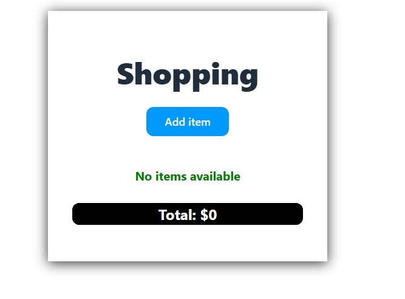
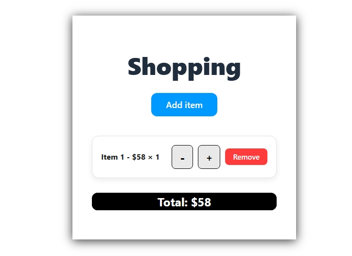
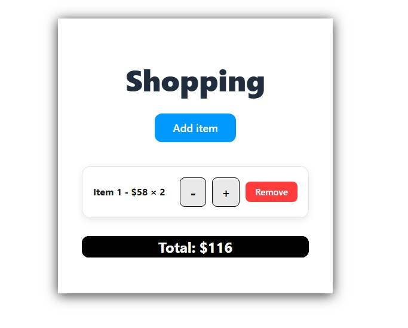
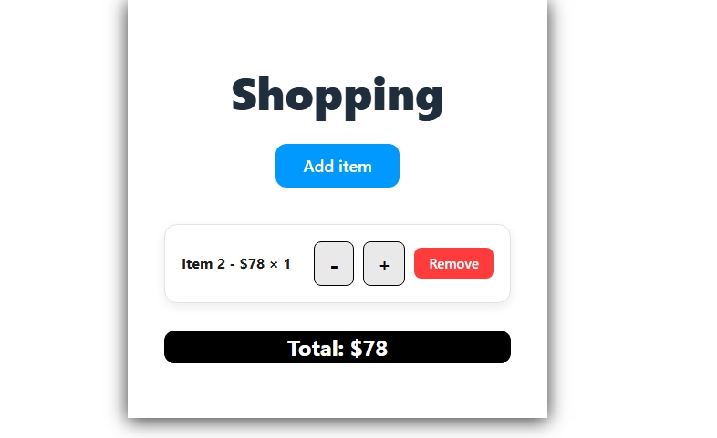

# Shopping Cart React App

A simple and modern shopping cart application built using **React**, featuring item management, quantity controls, total calculation, and clean UI styling.

---

## 📌 Features

* Add new items with random prices
* Increase/decrease item quantity
* Remove individual items
* Auto-calculated total price
* Clean and modern UI design
* Components separated for better structure

---

## 📁 Project Structure

```
/my-app
|----screenshot
        |--my-app/screenshot/Screenshot_5-12-2025_135238_localhost.jpeg
        |-- my-app/screenshot/Screenshot_5-12-2025_13523_localhost.jpeg 
        |--my-app/screenshot/Screenshot_5-12-2025_135211_localhost.jpeg 
        |--my-app/screenshot/Screenshot_5-12-2025_135222_localhost.jpeg 
        |--my-app/screenshot/Screenshot_5-12-2025_135230_localhost.jpeg
src/
│   ├── Shop.jsx
│   ├── ItemList.jsx
│   ├── Total.jsx
│   ├── Shop.css
│   ├── ItemList.css
│   └── Total.css
│
│── App.jsx
│── main.jsx
|--README.md
```

---

## 🚀 Getting Started
## screenshot
1.homepage


2.add item


3.add quantity


4.more add item


5.delete item

### 1. Clone the project

```
git clone https://github.com/your-repo/Shopping-cart.git
```

### 2. Navigate into project folder

```
cd my-app
```

### 3. Install dependencies

```
npm install
```

### 4. Run the development server

```
npm run dev
```

Your app will run at:

```
http://localhost:5173
```

---

## 🧩 Components Overview

### **Shop.jsx**

* Main page for the app
* Contains button to add items
* Holds item state (id, name, price, quantity)
* Passes props to ItemList and Total components

### **ItemList.jsx**

* Displays each item
* Has: Increase, Decrease, Remove buttons
* Clean card UI

### **Total.jsx**

* Calculates and displays total amount
* Uses reduce() for calculation

---

## 🎨 UI Styling

All styling done with pure CSS using three files:

* `Shop.css` — Page layout and main button
* `ItemList.css` — Item cards and buttons
* `Total.css` — Styled total box

---

## 📦 Technologies Used

* React
* JavaScript (ES6+)
* CSS3
* Vite (for fast bundling)

---


## 📜 License

MIT License
